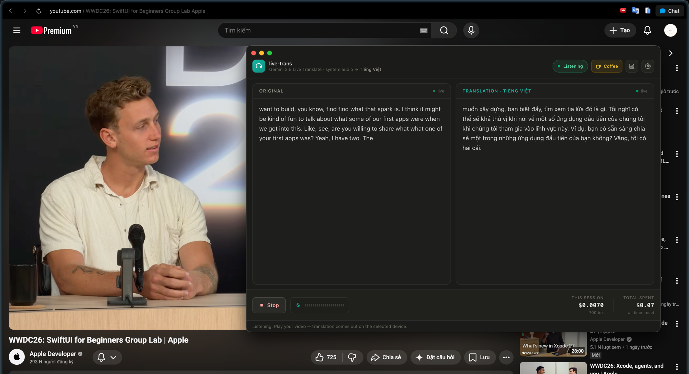

# live-trans

A desktop app that translates **any system audio in real time** using Google's
**Gemini 3.5 Live Translate**. Play a foreign-language YouTube video or course, flip the
switch, and hear the translation (and read live subtitles) in your chosen language.

> Built to scratch a real itch: watching Hindi / Chinese programming courses without
> understanding a word.



<sub>Translating Apple's WWDC SwiftUI session into Vietnamese, live — original + translation side by side, with a running cost meter.</sub>

## How it works

```
[System audio]                     AudioTee (Core Audio process tap, main process)
  ─ captures the whole system EXCEPT this app's own audio output ──► 16kHz PCM
  ─► IPC ─► renderer ─► WebSocket ─► gemini-3.5-live-translate-preview
                                  ◄─ translated 24kHz audio + source/target subtitles
  ─► Web Audio playback (pick any output device) + two-column live transcript + cost meter
```

The key trick: the audio tap **excludes our own `audio.mojom.AudioService` process**, so the
translated speech we play back is never re-captured. That avoids the feedback loop that
otherwise makes the model echo and repeat itself.

## Requirements

- **macOS 14.2+** (Core Audio taps). Windows/Linux not supported yet — see Roadmap.
- A **Gemini API key** with access to the `gemini-3.5-live-translate-preview` model.
- [Bun](https://bun.sh) (used as the package manager / runner).

## Run

```bash
bun install
bun run dev
```

Then in the app: paste your API key (stored encrypted in the OS keychain), pick a target
language and output device, and hit **Enable translation**. Grant the macOS audio-recording
permission when prompted. Untick "Play translated audio" for a subtitles-only mode.

## Scripts

- `bun run dev` — run the app (electron-vite)
- `bun run build` — production build
- `bun run typecheck` — TypeScript check

## Stack

Electron · electron-vite · React · TypeScript · Tailwind v4 · [audiotee](https://www.npmjs.com/package/audiotee) (Core Audio tap) · Gemini Live API (raw WebSocket, `v1alpha`)

## Roadmap / next steps

1. **Session resumption + auto-reconnect** — the Live API caps session length and sends
   `goAway` before dropping. We already receive `sessionResumptionUpdate` handles but ignore
   them; wire up `setup.sessionResumption` and reconnect transparently so long videos don't
   cut out. *(Highest priority.)*
2. **Packaging** — electron-builder for a `.dmg`; `asarUnpack` the `audiotee` binary, add
   `NSAudioCaptureUsageDescription` to Info.plist, code-sign + notarize.
3. **Windows support** — `audiotee` is macOS-only; add a WASAPI-loopback capture path
   (exclude-self equivalent) behind the same `capture:*` IPC.
4. **Pricing accuracy** — rates are editable estimates ($10/1M in+out by default); replace
   with official `gemini-3.5-live-translate-preview` numbers when published.
5. **UX** — source-language badge (from transcript `languageCode`), adjustable subtitle font,
   save/export transcript, global hotkey to toggle, optional "capture only one app"
   (`--include-processes`) mode.

## Notes

- The API key never leaves the machine: encrypted via Electron `safeStorage`, persisted in
  `electron-store`. Lifetime spend is tracked locally.
- Transcripts arrive as incremental deltas and are appended; `usageMetadata` is per-message
  incremental and is accumulated for the cost meter.
