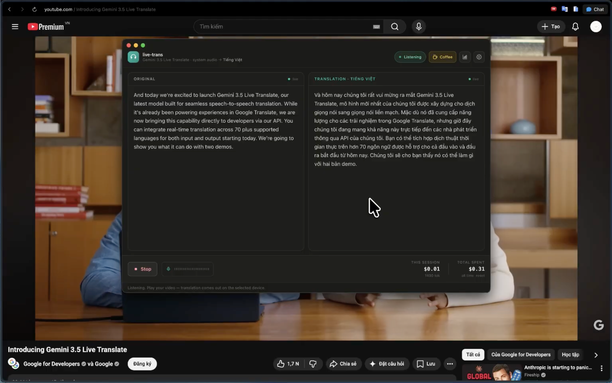

# Live Trans

A desktop app that translates **any system audio in real time** using Google's
**Gemini 3.5 Live Translate**. Play a foreign-language YouTube video or course, flip the
switch, and hear the translation (and read live subtitles) in your chosen language.

> Built to scratch a real itch: watching Hindi / Chinese programming courses without
> understanding a word.



<sub>Translating Google's "Introducing Gemini 3.5 Live Translate" video into Vietnamese, live — original + translation side by side, with a running cost meter.</sub>

## Download

Grab the latest **signed & notarized `.dmg`** from the
[**Releases page**](https://github.com/minhnhat165/live-trans/releases) — drag it into
Applications and open. Universal build (Apple Silicon + Intel), macOS 14.2+.

You'll still need your own [Gemini API key](#requirements). Prefer to build from source?
See [`docs/BUILD.md`](docs/BUILD.md).

## Using the app

1. **Get a Gemini API key** at [Google AI Studio](https://aistudio.google.com/apikey) with
   access to the `gemini-3.5-live-translate-preview` model.
2. Open live-trans → click the **⚙️ Settings** gear → paste your API key (stored encrypted in
   the macOS keychain) → pick your **target language**.
3. **Output device:** choose your **headphones**. The audio tap excludes this app's own output,
   but speakers can still leak translated audio back into the mic — headphones avoid that. For
   subtitles only, turn off **"Play translated audio"**.
4. Hit **▶ Enable translation** and grant the macOS audio-recording permission when prompted.
5. Play any foreign-language video or call. The **Original** column shows the detected speech;
   the **Translation** column shows your language, live — and the translated voice plays on the
   device you picked.
6. **📊 Usage** shows token counts and live cost; **■ Stop** ends the session. Long videos keep
   going — the session auto-resumes across the Live API's reconnects.

> 💡 Use headphones. Without them, your speakers feed the translated audio back into the tap
> and the model starts echoing itself.

## How it works

```
[System audio]                     AudioTee (Core Audio process tap, main process)
  ─ captures the whole system EXCEPT this app's own audio output ──► 16kHz PCM
  ─► IPC ─► renderer ─► WebSocket ─► gemini-3.5-live-translate-preview
                                  ◄─ translated 24kHz audio + source/target subtitles
  ─► Web Audio playback (pick any output device) + two-column live transcript + cost meter
```

The key trick: the audio tap **excludes our own `audio.mojom.AudioService` process**, so the
translated speech we play back is never re-captured. That avoids the feedback loop that
otherwise makes the model echo and repeat itself.

## Requirements

- **macOS 14.2+** (Core Audio taps). Windows/Linux not supported yet — see Roadmap.
- A **Gemini API key** with access to the `gemini-3.5-live-translate-preview` model.
- [Bun](https://bun.sh) (used as the package manager / runner).

## Run

```bash
bun install
bun run dev
```

Then in the app: paste your API key (stored encrypted in the OS keychain), pick a target
language and output device, and hit **Enable translation**. Grant the macOS audio-recording
permission when prompted. Untick "Play translated audio" for a subtitles-only mode.

## Scripts

- `bun run dev` — run the app (electron-vite)
- `bun run build` — production build
- `bun run typecheck` — TypeScript check

## Stack

Electron · electron-vite · React · TypeScript · Tailwind v4 · [audiotee](https://www.npmjs.com/package/audiotee) (Core Audio tap) · Gemini Live API (raw WebSocket, `v1alpha`)

## Roadmap / next steps

1. **Windows support** — `audiotee` is macOS-only; add a WASAPI-loopback capture path
   (exclude-self equivalent) behind the same `capture:*` IPC.
2. **Pricing accuracy** — rates are editable estimates ($10/1M in+out by default); replace
   with official `gemini-3.5-live-translate-preview` numbers when published.
3. **UX** — source-language badge (from transcript `languageCode`), adjustable subtitle font,
   save/export transcript, global hotkey to toggle, optional "capture only one app"
   (`--include-processes`) mode.

Done: ✅ session resumption + auto-reconnect · ✅ signed & notarized `.dmg` packaging.

## Notes

- The API key never leaves the machine: encrypted via Electron `safeStorage`, persisted in
  `electron-store`. Lifetime spend is tracked locally.
- Transcripts arrive as incremental deltas and are appended; `usageMetadata` is per-message
  incremental and is accumulated for the cost meter.

## Support

If live-trans saves you some time, you can buy me a coffee — it genuinely helps me keep
building and shipping. Thank you! ☕

[](https://ko-fi.com/minhnhat165)

## License

[PolyForm Noncommercial License 1.0.0](LICENSE) — you're free to use, study, and modify
live-trans for **noncommercial** purposes (personal use, learning, research, hobby projects).
**Commercial use is not permitted** without a separate license. If you'd like to use it
commercially, reach out.
